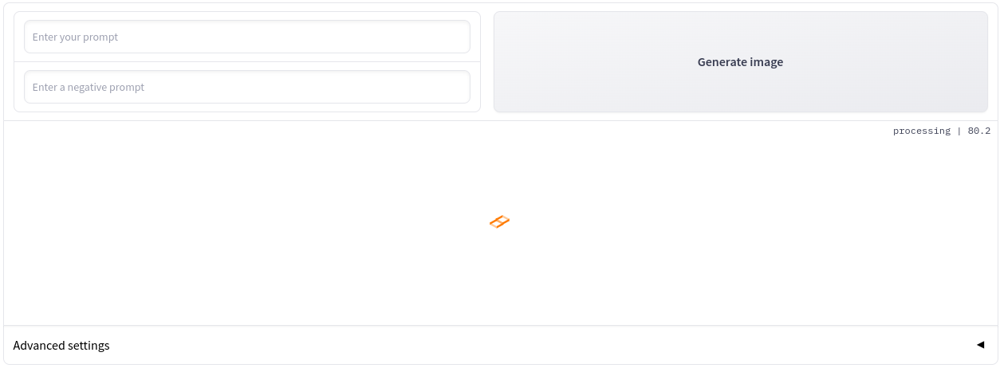

# Stable Diffusion XL Web

Welcome to the Stable Diffusion XL Web! This is a Gradio demo with a user-friendly web interface that supports [Stable Diffusion XL 1.0](https://github.com/Stability-AI/generative-models). In this demo, you can explore and interact with both the base and the refiner models.

This project was forked from the original [StableDiffusion v2.1 Demo WebUI](https://huggingface.co/spaces/gradio-client-demos/stable-diffusion). You can always refer to the Git commits to see the changes and enhancements we've made.

**Update:** We're excited to announce that [SD XL 1.0](https://huggingface.co/stabilityai/stable-diffusion-xl-base-1.0) has been released, and our Web UI demo now fully supports it! The best part is, you no longer need a separate application to obtain the model weights. Simply launch the Colab notebook to get started. And the best news of all, you can run this demo on Colab for free, even on T4 GPUs!

## Simple UI - Fresh Look

## Examples

## Support Us

If you find this demo helpful and insightful, please consider giving [this repository](https://github.com/ayush-thakur02/stable-diffusion-xl-web) a star ⭐. Your support is greatly appreciated, and it encourages us to continue improving and expanding this project.

